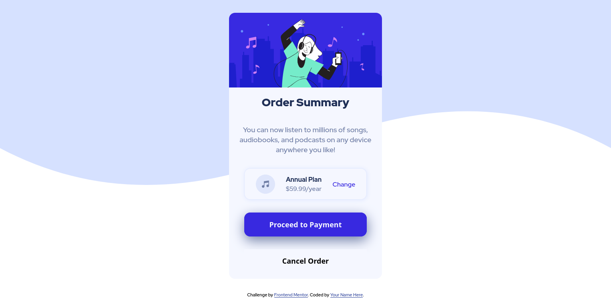

# Frontend Mentor - Order summary card


## Welcome! 👋

Thanks for checking out this front-end coding challenge.

[Frontend Mentor](https://www.frontendmentor.io) challenges help you improve your coding skills by building realistic projects.

**To do this challenge, you need a basic understanding of HTML and CSS.**


## Table of contents

- [Overview](#overview)
  - [Screenshot](#screenshot)
  - [Links](#links)
- [My process](#my-process)
  - [Built with](#built-with)
  - [What I learned](#what-i-learned)
  - [Continued development](#continued-development)
  - [Useful resources](#useful-resources)
- [Author](#author)
- [Acknowledgments](#acknowledgments)


## Overview

### Screenshot




### Links

- Solution URL: [Source Code](https://github.com/AlexdelCarmen/order-summary-challenge)
- Live Site URL: [Live Page](https://alexdelcarmen.github.io/order-summary-challenge/)

## My process

As usual, I started off by constructing the HTML file entirely, focusing on the mobile layout first, next I add the styling to shape the page up, with adding the media query to alter the background pattern depending on screen-size.

### Built with

- Semantic HTML5 markup
- CSS custom properties
- Flexbox
- Mobile-first workflow


### What I learned

Nothing super new, but good practice for Flexbox and basic CSS.

```css
.payment-button {
  padding: 1rem;
  background-color: var(--accent-2);
  font-size: var(--paragraph-text);
  color: var(--neutral-1);
  font-weight: 900;
  border-radius: 15px;
  border: 1px solid var(--accent-2);
  box-shadow: 1px 10px 30px var(--neutral-2);
}

.payment-button:hover,
.payment-button:active,
.payment-button:focus {
  opacity: 0.8;
}

```

### Continued development

Still needing to get a better eye for sizes/colors.

### Useful resources

- [W3Schools](https://www.w3schools.com/) - general resource for coding, used it for :root clarifications.

## Author

- Website - [Github Profile](https://github.com/AlexdelCarmen)
- Frontend Mentor - [@AlexdelCarmen](https://www.frontendmentor.io/profile/AlexdelCarmen)
- Twitter - [@AlekBorchov](https://twitter.com/AlekBorchov)

## Acknowledgments

Thanks Wendigon for ranting on the back for hours on end while I code.
